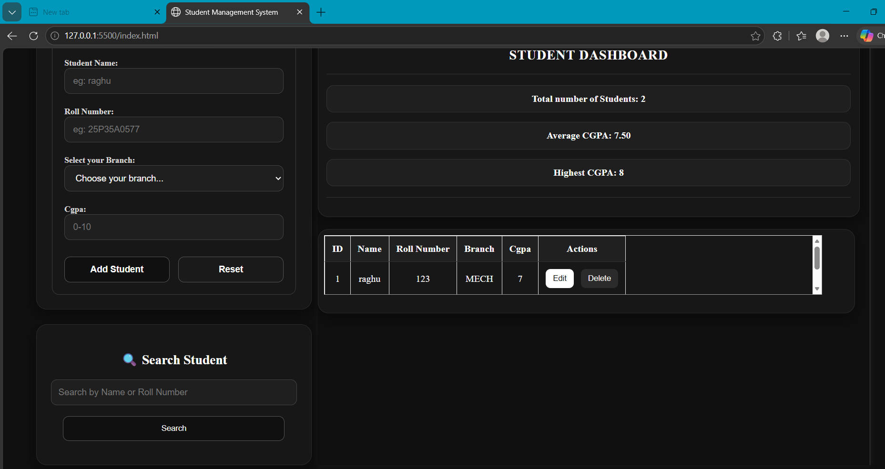
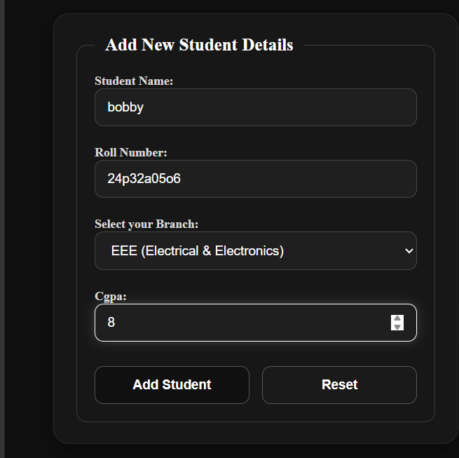
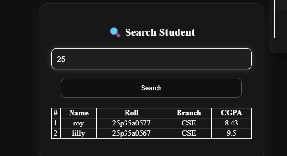
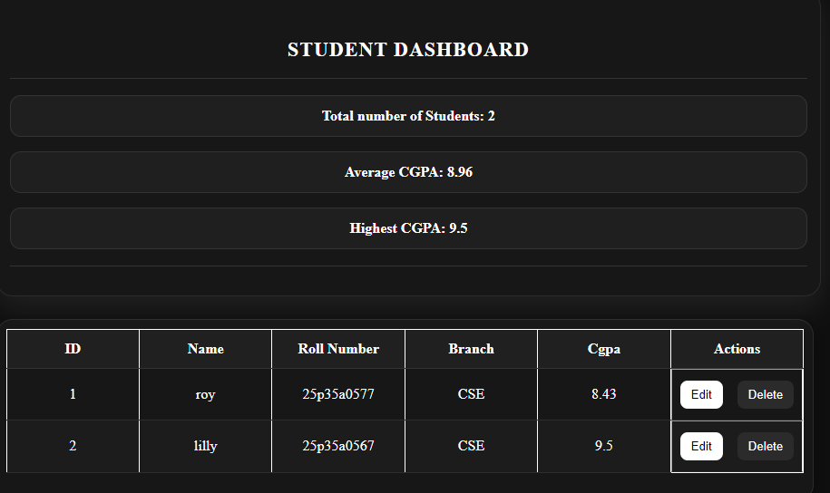
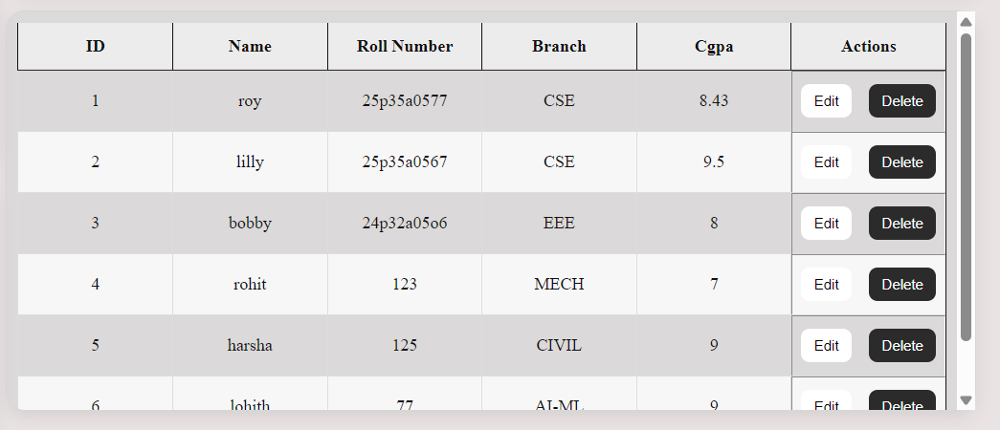
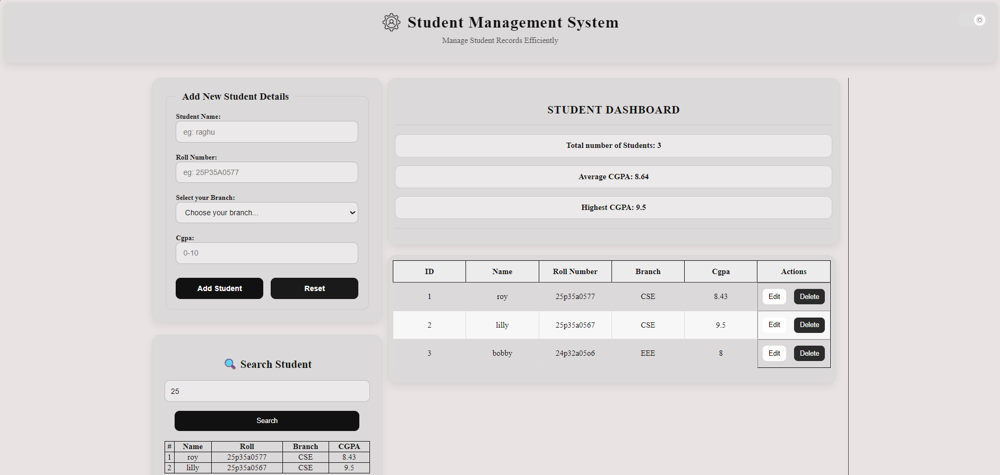

# 🎓 Student Management System

A simple and responsive Student Management System built using **HTML, CSS, and JavaScript**.

## ✨ Features

- ➕ Add Student
- ✏️ Edit Student
- 🗑️ Delete Student
- 🔍 Search Student
- 📊 Dashboard Statistics
- 💾 Local Storage Support
- 🌙 Dark / ☀️ Light Theme
- 📌 Sticky Header
- 📱 Responsive UI

## 🛠️ Technologies Used

- HTML5
- CSS3
- JavaScript
- Local Storage

## 📸 Screenshots

### 🏠 Home

### ➕ Add Student

### 🔍 Search Student

### 📊 Dashboard

### 📋 Student Table

### ☀️ Light Theme

## 🚀 Future Improvements

- Backend Integration
- User Authentication
- Database Support
- Export Student Data
- Attendance Management

## 👨‍💻 Author

**Roy**